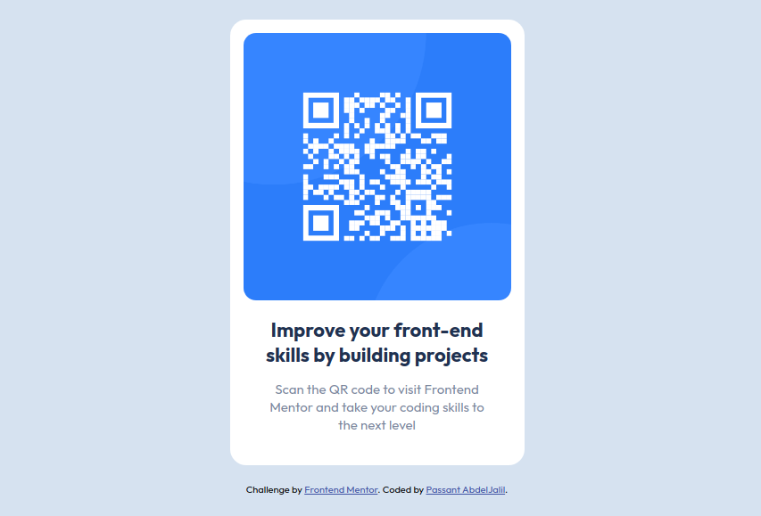

# Frontend Mentor - QR code component solution

This is a solution to the [QR code component challenge on Frontend Mentor](https://www.frontendmentor.io/challenges/qr-code-component-iux_sIO_H). Frontend Mentor challenges help you improve your coding skills by building realistic projects. 

## Table of contents

- [Frontend Mentor - QR code component solution](#frontend-mentor---qr-code-component-solution)
  - [Table of contents](#table-of-contents)
  - [Overview](#overview)
    - [Screenshot](#screenshot)
    - [Links](#links)
  - [Built with](#built-with)
  - [Author](#author)

## Overview

### Screenshot

### Links

- Solution URL: [Solution URL](https://your-solution-url.com)
- Live Site URL: [Live Site](https://qrcode-component-preview.netlify.app/)

## Built with

- Semantic HTML5 markup
- CSS3
- Flexbox
- BEM methodology

## Author

- Frontend Mentor - [@Passant-Abdelgalil](https://www.frontendmentor.io/profile/Passant-Abdelgalil)
- LinkedIn - [@Passant-Abdelgalil](https://www.linkedin.com/in/passant-abdelgalil/)
