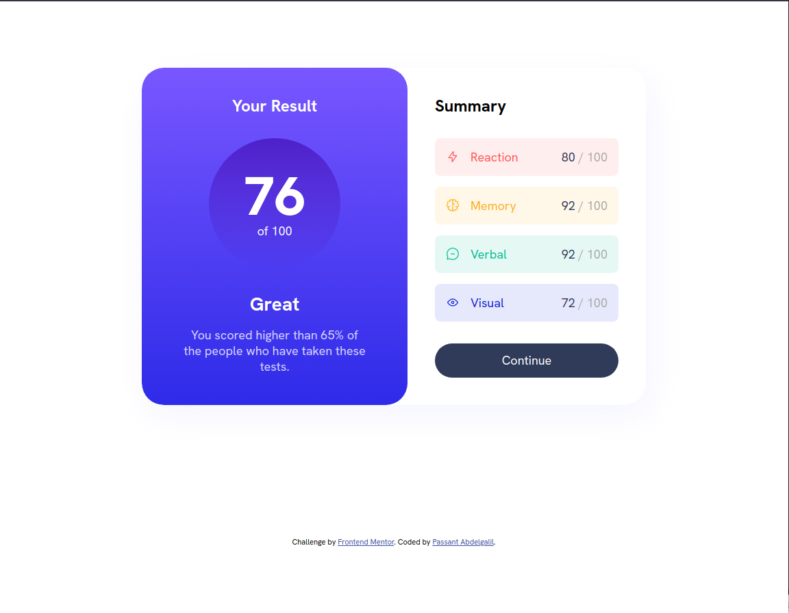
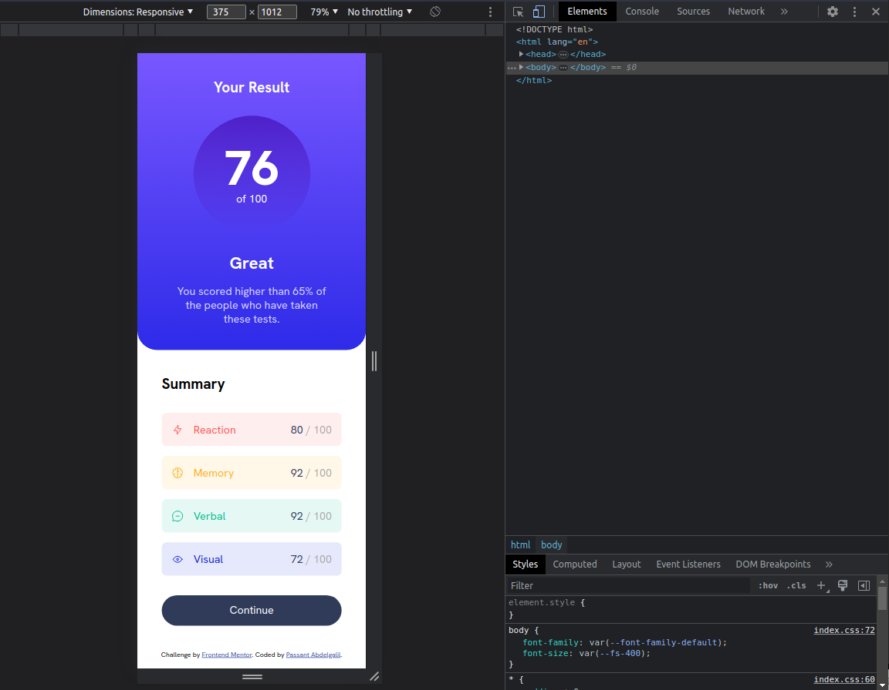

# Frontend Mentor - Results summary component solution

This is a solution to the [Results summary component challenge on Frontend Mentor](https://www.frontendmentor.io/challenges/results-summary-component-CE_K6s0maV). Frontend Mentor challenges help you improve your coding skills by building realistic projects. 

## Table of contents

- [Frontend Mentor - Results summary component solution](#frontend-mentor---results-summary-component-solution)
  - [Table of contents](#table-of-contents)
    - [Screenshot](#screenshot)
    - [Links](#links)
  - [Built with](#built-with)
  - [Author](#author)

### Screenshot

* Desktop

* Mobile

### Links

- Live Site URL: [Live Site](https://results-summary-c.netlify.app/)

## Built with

- Semantic HTML5 markup
- CSS3
- Flexbox / Grid

## Author

- Frontend Mentor - [@Passant-Abdelgalil](https://www.frontendmentor.io/profile/Passant-Abdelgalil)
- LinkedIn - [@Passant-Abdelgalil](https://www.linkedin.com/in/passant-abdelgalil/)